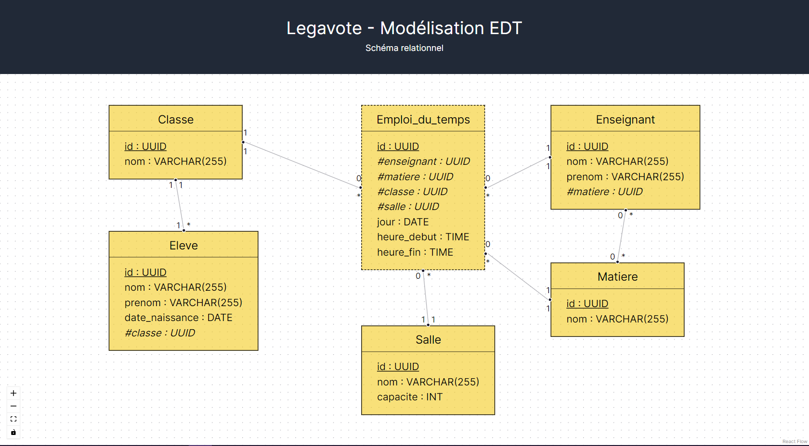

# ⏳ Legavote EDT 📅

Cette application a été réalisée dans le cadre du test technique pour Legavote.

⏱️ Temps passé : ~ 3h

## 📋 Enoncé

Écrire en React (Nextjs si souhaité) un projet qui affiche un schéma de base de données pour la modélisation d’un emploi du temps des élèves / enseignants d’un collège.

Contraintes sur le schéma :

- Au moins un clé étrangère (à mettre en évidence)
- Au moins une table de jointure (à mettre en évidence)
- Il n’est pas nécessaire de détailler toutes les colonnes possibles (3 / 4 par tables suffisent)

Contraintes sur l’affichage :

- Création de composants
- Utilisation de props
- Utilisation de librairie tierce autorisée

## 💡 Conception

- App NextJS classique (utilisation de l'app router & Typescript).
- 6 react components : TableNode, VerticalLink, HorizontalLink, StandardField, PrimaryKeyField, ForeignKeyField.
- Utilisation de la librairie reactflow pour l'affichage du schéma.
- Schéma relationnel (simplifié) :
  - 5 entités : Eleve, Enseignant, Classe, Matiere, Salle.
  - 1 table de jointure : Emploi_du_temps.

## 🚀 Fonctionnalités

- Visualisation du schéma relationnel.
- Mise en évidence de la table de jointure (pointillés).
- Mise en évidence des clés primaires (soulignées) et étrangères (# + italique).

## 🔨 Installation

_Note : Pour réaliser les étapes suivantes, assurez-vous d'avoir Node.js (version 18.17 ou supérieure) et npm (ou Yarn) installés sur votre machine. En cas de problèmes, vous trouverez plus de détails sur la [documentation de Next.js](https://nextjs.org/docs/getting-started/installation)._

1. Cloner le repo sur votre machine locale.
2. Aller dans le dossier du projet et éxecuter `npm install` ou `yarn install`.
3. Démarrer le serveur de développement Next.js avec `npm run dev` ou `yarn dev`.
4. Ouvrir un navigateur et aller à l'addresse [http://localhost:3000/](http://localhost:3000/) (le port peut être différent si cette adresse est déjà utilisée).
5. Pour arrêter le serveur, faire `Ctrl+C` dans le terminal.

## 📸 Screenshots

